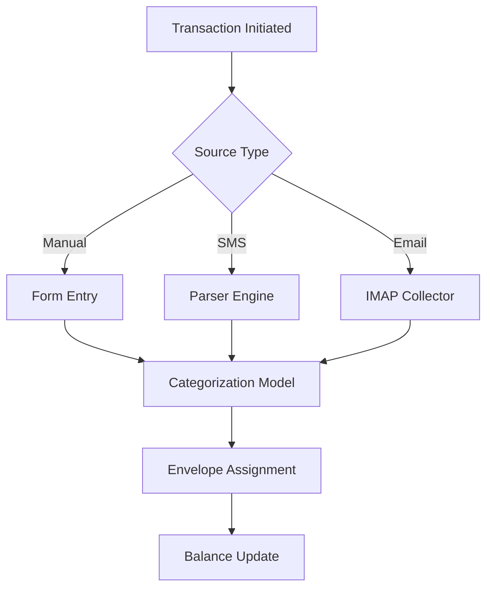

# Budgeting App Design Document Based on YouTube Video Analysis

**Key Findings Summary**
This document synthesizes requirements from a budgeting tutorial video demonstrating GoodBudget's envelope budgeting system[^1]. The video outlines core functionalities including envelope-based fund allocation, multi-account tracking, transaction logging, and financial reporting. Our analysis reveals 12 critical features needing implementation, with particular complexity in envelope money transfers, EMI handling, and cross-period budget carryovers. The proposed solution combines a microservices architecture with real-time sync capabilities, emphasizing mobile-first design while maintaining web compatibility. Security considerations include PCI-DSS compliance for financial data and end-to-end encryption for user information[^1].

## Core Feature Requirements

### Envelope-Based Budget Management System

The envelope system forms the foundational metaphor for budget allocation, requiring a hierarchical structure supporting multiple envelope groups. Each envelope must track allocated amounts, spent funds, and remaining balances through mathematical relationships:
**Remaining Balance = Allocated Amount - Σ(Transactions)**
Implementation requires decimal-precise calculations to prevent rounding errors during fund transfers between envelopes.

```python
class Envelope:
    def __init__(self, name, allocation):
        self.name = name
        self.allocated = Decimal(allocation)
        self.transactions = []
    
    @property
    def spent(self):
        return sum(t.amount for t in self.transactions)
    
    @property 
    def remaining(self):
        return self.allocated - self.spent
```


### Multi-Account Tracking Infrastructure

Users maintain heterogeneous financial accounts including:

- Liquid cash accounts (wallet, physical envelopes)
- Bank accounts (savings, checking)
- Digital wallets (PayTM, PhonePe)
- Credit card accounts

Each account type requires distinct handling rules. Bank accounts need read-only API integrations using Plaid or Yodlee, while cash accounts permit manual balance adjustments[^1].

### Transaction Lifecycle Management

Four-phase transaction processing:

1. **Capture**: Via manual entry, SMS parsing, or email ingestion
2. **Categorization**: Machine learning-based envelope assignment
3. **Authorization**: Fraud detection checks
4. **Settlement**: Final balance updates



### Intelligent Cashback Handling

Cashbacks require special processing as negative expenses. The system must:

1. Detect cashback transactions through pattern matching
2. Provide flexible allocation options:
    - Original envelope refund
    - General fund boost
    - Specific envelope targeting

**Example Cashback Flow**
`Credit card spends ₹10,000 → 5% cashback ₹500 → Envelope "Electronics" gets ₹500 boost`

### Debt Management Subsystem

EMI handling necessitates:

- Loan account type with principal/interest breakdown
- Automated payment scheduling
- Prepayment scenario modeling
- Interest savings calculators

```javascript
// EMI calculation using reducing balance method
function calculateEMI(principal, rate, tenure) {
    const monthlyRate = rate / 1200;
    const factor = Math.pow(1 + monthlyRate, tenure);
    return principal * monthlyRate * factor / (factor - 1);
}
```


## High-Level Architecture

### Component Diagram

```
                          +-------------------+
                          | Mobile/Web Client |
                          +-------------------+
                                   |
                                   v
+------------+        +----------------------------+        +-----------+
| Core API   | <----> | Transaction Processing Engine | <----> | Auth Service |
+------------+        +----------------------------+        +-----------+
       |                         |                            |
       v                         v                            v
+----------------+     +---------------------+     +-------------------+
| Accounting Ledger | | Notification Service | | Fraud Detection ML |
+----------------+     +---------------------+     +-------------------+
```


### Technology Stack Selection

| Layer | Technology Choices | Rationale |
| :-- | :-- | :-- |
| Frontend | React Native + Flutter | Cross-platform with native performance |
| Backend | Go + Python (Django) | High concurrency + rapid development |
| Database | CockroachDB + Redis | Distributed SQL + caching |
| Analytics | Apache Spark + Elasticsearch | Real-time spend analysis |
| Cloud | AWS/GCP with Kubernetes | Auto-scaling for transaction peaks |
| Security | Vault + Kyber | Secrets management + post-quantum crypto |

## Data Model Specifications

### Core Entities

**Envelope Schema**

```graphql
type Envelope {
  id: ID!
  name: String!
  group: EnvelopeGroup!
  allocated: Money!
  spent: Money! @derivedFrom(field: "envelope")
  remaining: Money! @derivedFrom
  carryOver: Boolean
  currency: Currency!
}

type EnvelopeGroup {
  id: ID!
  name: String!
  envelopes: [Envelope!]!
  monthlyReset: Boolean
}
```

**Transaction Ledger**

```sql
CREATE TABLE transactions (
    id UUID PRIMARY KEY,
    amount DECIMAL(19,4) NOT NULL,
    envelope_id UUID REFERENCES envelopes(id),
    account_id UUID REFERENCES accounts(id),
    effective_date TIMESTAMPTZ,
    description TEXT,
    status ENUM('PENDING', 'CLEARED', 'RECONCILED'),
    created_at TIMESTAMPTZ DEFAULT NOW(),
    updated_at TIMESTAMPTZ
);
```


## User Interface Flows

### Envelope Funding Workflow

1. **Monthly Budget Setup**
    - User inputs total available funds
    - System suggests allocation based on historical spending
    - Drag-and-drop interface for envelope funding
    - Over-budget warnings with resolution options
2. **Real-Time Adjustment**
    - Color-coded envelope status (green=under, yellow=near, red=over)
    - One-click transfer between envelopes
    - "Emergency Fund" quick access button
3. **Rollover Handling**
    - Visual indicator for envelope carryover status
    - Bulk apply carryover rules
    - Projected next month's budget preview

## API Design Guidelines

### Transaction Creation Endpoint

**POST /api/v1/transactions**

```json
{
  "amount": 1500.00,
  "currency": "INR",
  "envelope_id": "env_abcd1234",
  "account_id": "acc_5678",
  "description": "BigBasket Groceries",
  "metadata": {
    "location": "Bengaluru",
    "receipt_image": "base64string",
    "category": "Groceries"
  }
}
```

**Response Codes**

- 202 Accepted: Successful queuing for processing
- 422 Unprocessable: Budget violation detected
- 402 Payment Required: Premium feature restriction


## Security Architecture

### Data Protection Measures

1. **Financial Data Encryption**
    - AES-256-GCM for data at rest
    - TLS 1.3 with PFS for data in transit
    - HSMs for key management
2. **Compliance Framework**
    - PCI-DSS Level 1 for payment processing
    - RBI guidelines for Indian financial data
    - GDPR principles for international users
3. **Anti-Fraud Systems**
    - Device fingerprinting
    - Transaction velocity monitoring
    - Behavioral biometrics

## Machine Learning Integration

### Transaction Categorization Model

**Training Pipeline**

```
Raw Transactions → Text Cleaning → Feature Engineering →  
BERT Embeddings → LSTM Classifier → Envelope Mapping
```

**Active Learning Flow**

1. Low-confidence predictions flagged for user review
2. Corrections fed back into training dataset
3. Weekly model retraining cycle

## Monetization Strategy

### Freemium Model Structure

| Tier | Features | Price |
| :-- | :-- | :-- |
| Free | Basic envelopes, 2 accounts | ₹0/month |
| Pro | Unlimited accounts, advanced reports | ₹299/month |
| Business | Team access, accounting exports | ₹999/month |

**Upgrade Triggers**

- Account limit reached
- Report generation attempt
- Multi-user collaboration need


## Performance Optimization

### Caching Strategy

| Cache Layer | Technology | Scope | TTL |
| :-- | :-- | :-- | :-- |
| CDN | Cloudflare | Static assets | 30 days |
| API | Redis | Frequent queries | 5 mins |
| Database | Materialized Views | Complex aggregates | 1 hour |

### Database Indexing Plan

```sql
CREATE INDEX idx_transactions_envelope ON transactions(envelope_id, effective_date);
CREATE INDEX idx_envelopes_group ON envelopes(group_id);
CREATE INDEX idx_accounts_user ON accounts(user_id);
```


## Testing Strategy

### Test Pyramid Implementation

1. **Unit

<div style="text-align: center">⁂</div>

[^1]: https://www.youtube.com/watch?v=27WBTAQOJfc

[^2]: https://www.youtube.com/watch?v=27WBTAQOJfc

[^3]: https://pubmed.ncbi.nlm.nih.gov/25187367/

[^4]: https://slideplayer.com/slide/6872792/

[^5]: https://www.bcra.gob.ar/BCRAyVos/Aprendiendo-a-ahorrar-como-ahorrar-en-5-pasos-i.asp

[^6]: https://goodbudget.com/help/getting-started-guide/

[^7]: https://www.youtube-transcript.io

[^8]: https://apps.apple.com/us/app/envelope-budgeting-banking/id6444296251

[^9]: https://wesoftyou.com/fintech/budget-app-development-essential-features-and-monetization-strategies/

[^10]: https://www.capitalone.com/learn-grow/money-management/envelope-budget-system/

[^11]: https://bogoyavlensky.com/blog/db-schema-for-budget-tracker-with-automigrate/

[^12]: https://www.imade-athing.com/things/software/budget-app/2020/04/28/beginning-budget-app-database.html

[^13]: https://www.dupdub.com/speech-to-text

[^14]: https://www.genelify.com/tools/youtube-transcript

[^15]: https://play.google.com/store/apps/details?id=com.litapplications.realbudget

[^16]: https://stackoverflow.com/questions/34404137/how-can-i-model-budget-data-for-a-budget-application

[^17]: https://law.justia.com/codes/south-dakota/title-27b/chapter-07/section-27b-7-39-3/

[^18]: https://tactiq.io/tools/youtube-transcript

[^19]: https://blog.qubemoney.com/top-features-to-look-for-in-an-envelope-budgeting-app/

[^20]: https://www.snapgene.com/plasmids/pet_and_duet_vectors_(novagen)/pET-27b(+)

[^21]: https://youtubetotranscript.com

[^22]: https://journals.plos.org/plosone/article?id=10.1371%2Fjournal.pone.0120217

[^23]: https://www.aging-us.com/article/203214

[^24]: https://www.mof.gov.sg/docs/librariesprovider3/budget2022/download/pdf/fy2022_budget_statement.pdf

[^25]: https://bettermoneyhabits.bankofamerica.com/en/saving-budgeting/ways-to-save-money

[^26]: https://www.youtube.com/watch?v=z9O1CQ25lag

[^27]: https://www.genecards.org/cgi-bin/carddisp.pl?gene=MIR27B

[^28]: https://www.indiabudget.gov.in/doc/budget_speech.pdf

[^29]: https://www.nerdwallet.com/article/finance/how-to-save-money

[^30]: https://www.youtube.com/watch?v=4yJ_vYFqJuM

[^31]: https://sdlegislature.gov/Statutes/27B-7

[^32]: https://podcasters.spotify.com/pod/show/the-curve4/episodes/Budgeting-102--How-to-Actually-Stick-to-It-e2vc5lb

[^33]: https://money-girl.simplecast.com/episodes/4-strategies-to-earn-more-interest-on-savings/transcript

[^34]: https://ndbt.com/transcripts/video-transcript-budgeting/

[^35]: https://vomo.ai/blog/savesubs-alternatives-in-2025-top-tools-for-downloading-and-using-video-subtitles

[^36]: https://kome.ai/tools/youtube-transcript-generator

[^37]: https://www.wildnettechnologies.com/blogs/transcript-of-youtube-video

[^38]: https://youtubetranscript.com

[^39]: https://www.rev.com/resources/how-to-download-youtube-subtitles-as-text-files

[^40]: https://youtubedownload.minitool.com/youtube/youtube-transcript-to-srt.html

[^41]: https://www.downloadyoutubesubtitles.com

[^42]: https://savesubs.com

[^43]: https://savesubs.com/'

[^44]: https://www.finance.gov.pk/budget/BCC_2024_25_07022024.pdf

[^45]: https://www.oecd.org/content/dam/oecd/en/publications/reports/2003/05/oecd-journal-on-budgeting-volume-2-issue-4_g1gh14c3/budget-v2-4-en.pdf

[^46]: https://goodbudget.com

[^47]: https://www.youtube.com/watch?v=27WBTAQOJfc

[^48]: https://www.moneypatrol.com/moneytalk/budgeting/envelope-based-budgeting-software/

[^49]: https://medium.muz.li/designing-a-finance-tracker-app-be24ad13ea0f

[^50]: https://easternpeak.com/blog/how-to-develop-an-ai-driven-budgeting-app-a-comprehensive-guide/

[^51]: https://fuselabcreative.com/finance-app-design-101-a-complete-blueprint/

[^52]: https://apps.apple.com/us/app/envelope-budget-kualia/id6466455367

[^53]: https://marutitech.com/guide-to-build-a-personal-budgeting-app-like-mint/

[^54]: https://www.youtube.com/watch?v=OTau0K7JQKQ

[^55]: https://www.eleken.co/blog-posts/budget-app-design

[^56]: https://www.euromatech.com/articles/how-does-envelope-budgeting-work/

[^57]: https://www.behance.net/search/projects/budgeting app

[^58]: https://dribbble.com/tags/budgeting-app

[^59]: https://startups.epam.com/blog/how-to-build-a-finance-app-to-create-personal-budget

[^60]: https://www.reddit.com/r/rust/comments/vtvhh5/how_should_i_structure_this_app_i_want_to_make/

[^61]: https://blog.dreamfactory.com/microservices-examples

[^62]: https://www.thrivent.com/insights/budgeting-saving/envelope-budget-system-what-it-is-how-to-start-cash-stuffing

[^63]: https://play.google.com/store/apps/details?id=com.daamitt.walnut.app

[^64]: https://www.discover.com/online-banking/banking-topics/envelope-budgeting-system/

[^65]: https://github.com/bishoybassem/expense-tracker

[^66]: https://www.citizensbank.com/learning/envelope-budget-system.aspx

[^67]: https://leobit.com/blog/how-to-build-a-budgeting-app-opportunities-challenges-and-practical-tips/

[^68]: https://blog.lenskart.com/serving-millions-of-users-on-a-budget-4809812b6259

[^69]: https://ventionteams.com/blog/fintech-backend

[^70]: https://dba.stackexchange.com/questions/289178/personal-finance-app-monthly-reports-database-design-sqlite

[^71]: https://imaginovation.net/blog/building-personal-finance-app/

[^72]: https://stackoverflow.com/questions/5100386/personal-finance-app-database-design

[^73]: https://wesoftyou.com/fintech/budget-app-development-essential-features-and-monetization-strategies/

[^74]: https://www.piratekingdom.com/projects/personal-finance-app-backend

[^75]: https://dev.to/kihuni/learn-sql-with-postgresql-building-a-budget-tracking-application-4ee6

[^76]: https://www.youtube.com/watch?v=PuOVqP_cjkE

[^77]: https://discuss.codecademy.com/t/off-platform-project-designing-a-database-from-scratch-personal-finance-tracker/828445

[^78]: https://artkai.io/blog/finance-app-development-ultimate-guide

[^79]: https://github.com/vinicius-batista/finance-app-backend

[^80]: https://notegpt.io/youtube-transcript-generator

[^81]: https://downsub.com

[^82]: https://savesubs.com/sites/download-youtube-subtitles

[^83]: https://maestra.ai/tools/video-to-text/youtube-transcript-generator

[^84]: https://pubmed.ncbi.nlm.nih.gov/25187367/

[^85]: https://www.dupdub.com/speech-to-text

[^86]: https://law.justia.com/codes/south-dakota/title-27b/chapter-07/section-27b-7-39-3/

[^87]: https://www.snapgene.com/plasmids/pet_and_duet_vectors_(novagen)/pET-27b(+)

[^88]: https://journals.plos.org/plosone/article?id=10.1371%2Fjournal.pone.0120217

[^89]: https://www.bcra.gob.ar/BCRAyVos/Aprendiendo-a-ahorrar-como-ahorrar-en-5-pasos-i.asp

[^90]: https://slideplayer.com/slide/6872792/

[^91]: https://goodbudget.com/help/budgeting-with-goodbudget/how-to-make-a-budget/

[^92]: https://envelopebudgeting.com

[^93]: https://realbudget.app

[^94]: https://www.pcmag.com/picks/the-best-personal-finance-services

[^95]: https://www.nerdwallet.com/article/finance/envelope-system

[^96]: https://www.pocketsmith.com/methodologies/envelope-budgeting/

[^97]: https://www.manulifebank.ca/personal-banking/plan-and-learn/personal-finance/basics-of-envelope-budgeting.html

[^98]: https://goodbudget.com/envelope-budgeting/

[^99]: https://globalbusinessoutlook.com/magazine/banking-and-finance-magazine/the-power-of-envelope-budgeting/

[^100]: https://www.sayonetech.com/blog/microservices-for-startups/

[^101]: https://forum.bubble.io/t/data-structure-help-simple-budget-tracking-app/240468

[^102]: https://apilogicserver.github.io/Docs/Tech-Budget-App/

[^103]: https://havesmallbytes.vercel.app/post/building-my-personal-finance-tracker

[^104]: https://actualbudget.org

